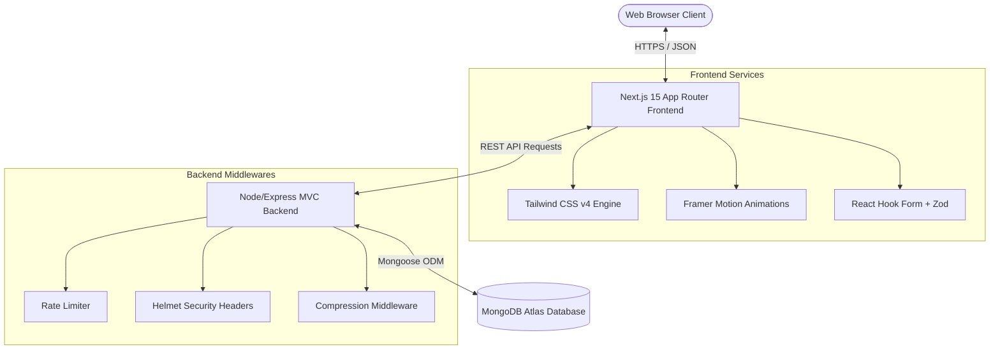

# Outpro.India - Corporate Profile Web Platform

An enterprise-grade, luxury digital presence platform designed and engineered for **Outpro.India**. This repository follows a monorepo structure containing a Next.js 15 (App Router, React 19, Tailwind v4, Framer Motion) frontend and a Node.js/Express MVC REST API backend connected to MongoDB Atlas.

---

## 🏗 Architecture & System Design



---

## 📂 Repository Folder Structure

```
/ (workspace root)
├── README.md                      # Complete Developer & System Documentation
├── frontend/                      # Next.js 15 Frontend Application
│   ├── app/                       # Page Router & Layout segments
│   │   ├── about/                 # Company Story & Leadership Grid
│   │   ├── services/              # Capabilities Catalog & Detail Slugs
│   │   ├── portfolio/             # Case Studies with KPI Dashboards
│   │   ├── testimonials/          # Customer Feedback Lists
│   │   ├── contact/               # Validated Contact Form Interface
│   │   ├── layout.tsx             # Root template & Global Context mapping
│   │   └── page.tsx               # Immersive Homepage
│   ├── components/                # Reusable UI & Layout Components
│   │   ├── layout/                # Responsive Header Navbar & Footer
│   │   └── ui/                    # Accordion, StatsCounter, LoadingSkeletons
│   ├── context/                   # Context Providers (Theme Mode toggle)
│   ├── services/                  # Axios Endpoint request mappings
│   ├── utils/                     # Conditional class string helper
│   ├── types/                     # Shared TypeScript interfaces
│   └── package.json               # Frontend dependencies list
│
└── backend/                       # Express MVC REST API Backend
    ├── src/
    │   ├── config/                # Database connections and Seed scripts
    │   ├── controllers/           # Endpoint handlers & validation
    │   ├── models/                # Mongoose Database Schemas
    │   ├── routes/                # Endpoint routing registries
    │   ├── middleware/            # Rate limiting & Global error catch
    │   └── index.ts               # Express boot entrypoint
    ├── tsconfig.json              # TypeScript compilation setup
    └── package.json               # Backend dependencies list
```

---

## 🚀 Installation & Startup Guide

### Prerequisites
- [Node.js](https://nodejs.org/) v18.0.0 or higher
- [MongoDB Community Server](https://www.mongodb.com/try/download/community) running locally, or a [MongoDB Atlas](https://www.mongodb.com/cloud/atlas) account.

### Step 1: Clone and Set Up the Backend
1. Navigate into the `backend/` directory:
   ```bash
   cd backend
   ```
2. Copy the sample environment file and configure variables:
   ```bash
   cp .env.example .env
   ```
   *Edit `.env` and set your `MONGODB_URI` (defaults to local database: `mongodb://localhost:27017/outpro`).*
3. Install dependencies:
   ```bash
   npm install
   ```
4. Seed the database with high-quality sample data:
   ```bash
   npm run seed
   ```
5. Launch the backend API server in development mode:
   ```bash
   npm run dev
   ```
   *The Express server boots on [http://localhost:5000](http://localhost:5000).*

### Step 2: Set Up the Frontend
1. Navigate into the `frontend/` directory:
   ```bash
   cd ../frontend
   ```
2. Install dependencies:
   ```bash
   npm install
   ```
3. Launch the Next.js development server:
   ```bash
   npm run dev
   ```
   *The frontend dashboard launches on [http://localhost:3000](http://localhost:3000).*

---

## 🗄 Database Schema Design

We leverage Mongoose models inside the `backend/src/models/` directory:

1. **Service (`Service.ts`)**:
   - `name`: string (required)
   - `slug`: string (unique, indexed)
   - `icon`: string (Lucide identifier code, e.g. `'Code'`)
   - `shortDesc`: string
   - `longDesc`: string
   - `features`: array of strings
   - `benefits`: array of strings
   - `techStack`: array of strings
   - `faqs`: array of `{ question: string, answer: string }`

2. **Project (`Project.ts`)**:
   - `title`: string (required)
   - `slug`: string (unique, indexed)
   - `category`: ObjectId (references `Category` model)
   - `description`: string
   - `images`: array of strings (Unsplash URLs)
   - `challenge`: string
   - `solution`: string
   - `kpis`: array of `{ label: string, value: string }`
   - `clientFeedback`: `{ rating: number, comment: string, reviewerName: string, reviewerRole: string }`
   - `technologies`: array of strings

3. **Category (`Category.ts`)**:
   - `name`: string (unique)
   - `slug`: string (unique, indexed)

4. **Testimonial (`Testimonial.ts`)**:
   - `clientName`: string (required)
   - `role`: string
   - `company`: string
   - `text`: string
   - `rating`: number (1-5)
   - `avatar`: string

5. **TeamMember (`Team.ts`)**:
   - `name`: string (required)
   - `role`: string
   - `bio`: string
   - `image`: string
   - `socials`: `{ linkedin?: string, twitter?: string, github?: string }`
   - `order`: number (sorting order)

6. **ContactMessage (`Contact.ts`)**:
   - `name`: string (required)
   - `email`: string (required)
   - `company`: string (optional)
   - `subject`: string (required)
   - `message`: string (required)

7. **NewsletterSubscriber (`Subscriber.ts`)**:
   - `email`: string (unique, lowercased, indexed)
   - `active`: boolean (default: true)

---

## ⚙ API Endpoint Documentation

All backend endpoints are prefixed with `/api`. Rate limiting is configured at **100 requests per 15 minutes per IP**.

### 1. Services
- **`GET /api/services`**: Returns a list of all services with brief metadata for catalog grid pages.
- **`GET /api/services/:slug`**: Returns detailed description, benefits, tech specs, and FAQs for a specific service.

### 2. Portfolio & Case Studies
- **`GET /api/portfolio`**: Returns all case study listings, populated with their associated category models. Optionally filter by category ID using query string: `GET /api/portfolio?category=ID`.
- **`GET /api/portfolio/:id`**: Returns full solution writeups, image slide lists, KPI metrics, and client quotes. Supports querying by Mongoose ObjectId or slug string.

### 3. Testimonials & Team
- **`GET /api/testimonials`**: Returns customer testimonials sorted by creation date.
- **`GET /api/team`**: Returns team members sorted by display order.

### 4. Forms & Interactive Actions
- **`POST /api/contact`**: Submits a contact inquiry. Data is validated with Zod.
  - **Payload**:
    ```json
    {
      "name": "Arjun Das",
      "email": "arjun@acme.com",
      "company": "Acme Inc.",
      "subject": "Platform Modernization",
      "message": "We need to re-architect our legacy checkout dashboards into a headless system."
    }
    ```
- **`POST /api/newsletter`**: Submits an email for newsletter subscription. Checks for duplicate registration.
  - **Payload**:
    ```json
    {
      "email": "arjun@acme.com"
    }
    ```

---

## ☁ Deployment Guide

### Database (MongoDB Atlas)
1. Sign up for a free shared cluster at [MongoDB Atlas](https://www.mongodb.com/cloud/atlas).
2. Create a database user and capture the connection URI:
   `mongodb+srv://<username>:<password>@cluster.mongodb.net/outpro`
3. Whitelist access IP addresses (`0.0.0.0/` for dynamic host providers).

### Backend (Render / Railway)
1. Link your GitHub repository to [Render](https://render.com/) or [Railway](https://railway.app/).
2. Select **Web Service** node template and point to the `backend/` directory root.
3. Configure the start command:
   - Build: `npm run build`
   - Start: `npm start`
4. Set Environment variables in the dashboard:
   - `PORT=5000`
   - `NODE_ENV=production`
   - `MONGODB_URI=mongodb+srv://...`
   - `CORS_ORIGIN=https://outpro-frontend.vercel.app` (your frontend domain)

### Frontend (Vercel)
1. Import repository to [Vercel](https://vercel.com/).
2. Point build configurations to the `frontend/` directory.
3. Vercel automatically detects Next.js build frameworks.
4. Add Environment Variable:
   - `NEXT_PUBLIC_API_URL=https://outpro-backend.onrender.com/api` (your production backend API URL)

---

## 🛠 User Manual & Administration

### Managing Submissions
- When a user submits an inquiry through the **Contact Form**, it is saved directly to the `contactmessages` MongoDB collection.
- Inquiries can be easily routed to CRMs (like HubSpot, Zoho) or email automation systems by adding triggers inside `backend/src/controllers/contactController.ts`.

### Managing Subscribers
- Newsletter subscribers are saved in the `newslettersubscribers` collection.
- To export subscribers for campaigns (e.g., Mailchimp, Sendgrid), administrative tools can query the `NewsletterSubscriber` model using:
  ```javascript
  const emails = await NewsletterSubscriber.find({ active: true }, 'email');
  ```

---

## ⚙ Maintenance & SLA Plan

To ensure the corporate portal achieves PageSpeed scores of **95+** and security compliance:
1. **Rate Limiting**: Configured inside `backend/src/index.ts` to prevent DDoS or mail spamming attempts.
2. **Security Audits**: The backend uses **Helmet** to force HTTPS, restrict iframe nesting (Clickjacking protection), and block MIME type sniffing.
3. **Data Compression**: Gzip compression is enabled via the `compression` package to reduce transfer sizes for JS/CSS files by up to 70%.
4. **Code Audits**: Run `npm run build` locally before pushing to Vercel/Render to capture compilation warning states.
